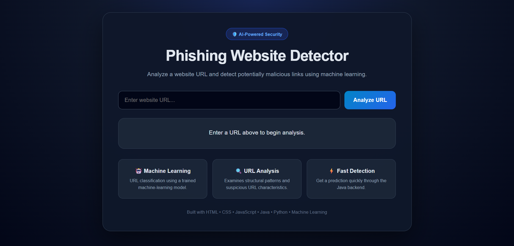
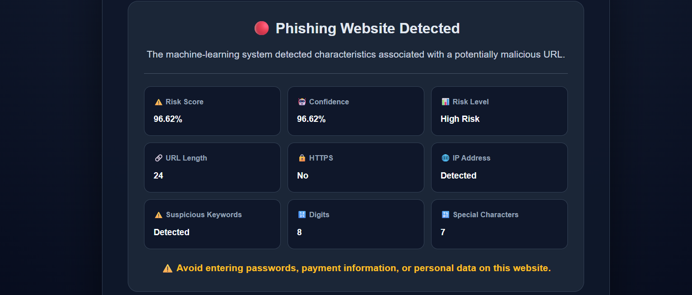
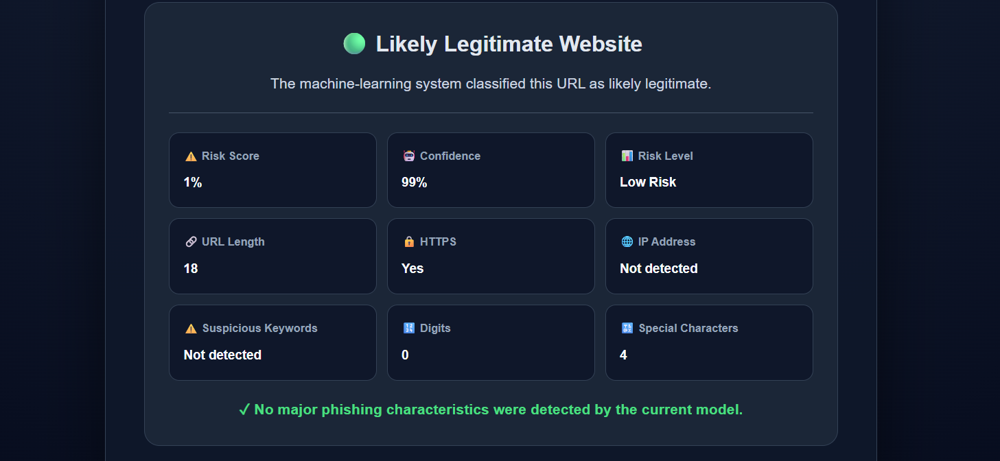

# 🛡️ Phishing Website Detector

An AI-powered web application that analyzes website URLs and detects potentially phishing or legitimate websites using Machine Learning.

## 🚀 Overview

Phishing attacks use fake websites and malicious URLs to trick users into revealing sensitive information such as passwords, banking details, and personal data.

This project combines:

- 🤖 Machine Learning
- 🐍 Python
- ☕ Java
- 🌐 HTML
- 🎨 CSS
- ⚡ JavaScript

to build an end-to-end phishing URL detection system.

## ✨ Features

- 🔍 Analyze website URLs
- 🤖 Machine-learning based classification
- 📊 Phishing probability and confidence
- ⚠️ Risk-level indication
- 🔒 HTTPS detection
- 🌐 IP-address detection
- 🔎 Suspicious keyword detection
- 🔢 URL structure analysis
- ⚡ Java backend API
- 📱 Responsive web interface

## 🧠 Machine Learning

The model was trained using the PhishStorm phishing URL dataset.

### Machine Learning Pipeline

```text
Website URL
     ↓
URL Feature Extraction
     ↓
Structural Features
     +
Character-Level TF-IDF Features
     ↓
Feature Scaling
     ↓
Logistic Regression
     ↓
Prediction
     ↓
Phishing / Legitimate

## 📊 Model Performance

The current model achieved approximately:

97.91% accuracy

on the held-out test set used during development.

The model uses:

•21 structural URL features
•Character-level TF-IDF
•StandardScaler
•Logistic Regression

## 🏗️ System Architecture

HTML + CSS + JavaScript
          ↓
     Java Backend
          ↓
      Python ML
          ↓
   Trained ML Model
          ↓
      Prediction
          ↓
     JSON Response
          ↓
      Web Interface

## 📁 Project Structure

Phishing-Website-Detector
│
├── frontend
│   ├── index.html
│   ├── style.css
│   └── script.js
│
├── backend
│   └── Main.java
│
├── ml
│   ├── dataset.csv
│   ├── urlset.csv
│   ├── train_model.py
│   ├── test_model.py
│   ├── predict.py
│   ├── phishing_model.pkl
│   ├── vectorizer.pkl
│   └── scaler.pkl
│
├── .gitignore
└── README.md

## ⚙️ How to Run

1. Start the Java Backend
Open PowerShell and navigate to:

C:\project-java\Phishing-Website-Detector\backend

Compile the Java backend:

javac Main.java

Run the backend:

java Main

You should see:

Java backend running on http://localhost:8080

2. Start the Frontend

Open:
frontend/index.html

using VS Code Live Server.
The application will open in your browser.

3. Analyze a URL

Enter a website URL such as:

https://google.com
or:
http://192.168.1.1/login

Then click:
Analyze URL

## 🔬 Example Analysis

Legitimate URL

https://google.com

The application displays:

🟢 Likely Legitimate Website

Suspicious URL

http://192.168.1.1/login

The application can identify characteristics such as:

🔴 Phishing Website Detected
🌐 IP Address: Detected
⚠️ Suspicious Keywords: Detected
🔒 HTTPS: No

## 🛠️ Technologies Used

Technology     Purpose
HTML     Frontend structure
CSS     User interface design
JavaScript     Frontend interaction
Java     Backend API
Python     Machine Learning
Scikit-learn     ML algorithms
Pandas     Data processing
NumPy     Numerical operations
TF-IDF     URL text representation
Logistic Regression     Classification
Git / GitHub     Version control

## 🔐 Security Analysis

The application analyzes several URL characteristics, including:

• URL length
• Hostname length
• Domain structure
• Hyphens and underscores
• Digits
• Path structure
• Special characters
• Query parameters
• HTTPS usage
• IP-address hostnames
• Suspicious keywords

These features are combined with character-level TF-IDF representations and passed to the trained machine-learning model.

## ⚠️ Important Note

The displayed risk score represents the model's estimated phishing probability. It is not a guarantee that a website is safe or malicious.

The trusted-domain list used by the application is an allowlist for specific domains and should not be interpreted as proof that a website is completely safe.

Users should independently verify unfamiliar links and avoid entering sensitive information on suspicious websites.

## 🎯 Future Improvements

🌐 Real-time domain reputation checking
🔌 Browser extension
🔎 WHOIS and domain-age analysis
🔐 SSL certificate analysis
🌍 DNS-based detection
🤖 Advanced machine-learning models
☁️ Cloud deployment
🔄 Continuous model retraining
📈 Detection history and analytics

## 💡 Project Highlights

This project demonstrates an end-to-end AI/ML application rather than only a standalone machine-learning model.

It integrates:

HTML + CSS + JavaScript + Java + Python + Machine Learning

into a working cybersecurity application.

## 👨‍💻 Project

Phishing Website Detector
Built as an AI/ML cybersecurity project focused on detecting potentially phishing URLs using machine learning and full-stack integration.

### After pasting

Your README.md should be directly here:

```text
Phishing-Website-Detector
├── .gitignore
├── README.md
├── frontend
├── backend
└── ml

## 🖼️ Project Screenshots

### Main Interface



### Phishing Detection Result



### Legitimate Website Result

## 🖼️ Project Screenshots

### Main Interface


### Phishing Detection Result


### Legitimate Website Result

